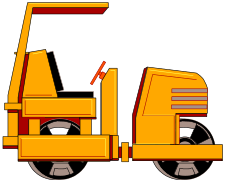

# Roller


Paving the road, with the ability to create and update projects from a template repo.


## Commands
Pull down initial template:
````
roller create <git repo url>
````

Update from template repo:
````
roller update <optional: reference/version, otherwise uses default branch>
````

Performs a user-defined action:
````
roller [action]
````

Synchronises template changes with the provided target directory, useful when building and testing a template:

````
roller sync <optional: target dir, defaults to 'roller_output', relative to working dir>
````


## Support
Please raise an issue, or use Discord TBD.
